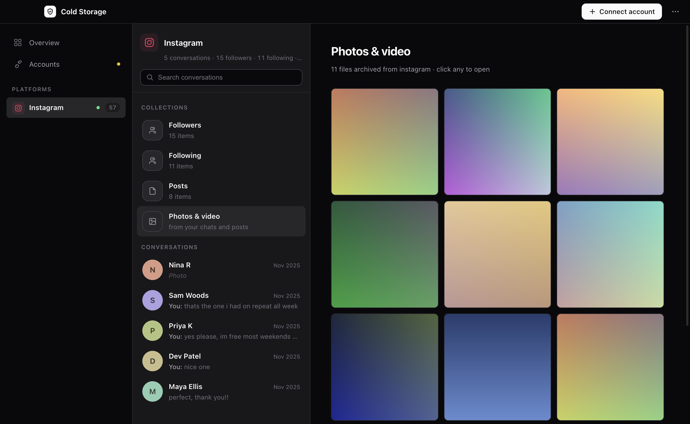

<div align="center">


# Cold Storage

**A cold copy of your social media. On your machine, not their servers.**

Connect an account once. It requests your official export, downloads it, and keeps an
encrypted, searchable copy on your Mac — on a schedule, in the background, forever.
Instagram, Facebook, X, Google, Snapchat, LinkedIn and Reddit automatically; Discord,
Telegram, WhatsApp and Slack by hand.

<a href="https://github.com/arhxam/cold-storage/releases/latest/download/ColdStorage-macOS-arm64.dmg"></a>

<sub>**Signed and notarized by Apple.** Open the DMG, drag to Applications, done.<br>
No Terminal, no right-click workaround, no security warning.</sub>

<br><br>

<a href="https://github.com/arhxam/cold-storage/releases/latest"></a>
<a href="https://github.com/arhxam/cold-storage/actions/workflows/ci.yml"></a>


</div>

<br>

<p align="center"></p>

## Install

**Mac app — [⬇ Download the DMG](https://github.com/arhxam/cold-storage/releases/latest/download/ColdStorage-macOS-arm64.dmg)** (Apple Silicon, ~110 MB)

Open it, drag **Cold Storage** to Applications, and open it from there. It's
signed and notarized, so it just opens — no right-click, no warning. On first
launch it sets up your encrypted archive and puts a Recovery Kit on your Desktop.

**Command line** — same engine, any platform with Python:

```bash
curl -LsSf https://raw.githubusercontent.com/arhxam/cold-storage/master/install.sh | sh
```

<sub>Prefer to inspect first? [Read the installer](install.sh) · [all downloads](https://github.com/arhxam/cold-storage/releases/latest) · Windows and Linux app builds aren't ready yet.</sub>

## Why

Platforms can ban an account with no warning and no chance to export. When that
happens you lose everything — chats, photos, the people you followed — and the
"Download your data" button stops working too. **The backup has to already exist.**

Cold storage is what you call the copy you keep offline, out of reach, for the day the
live system fails. That's what this is: a **second layer** underneath accounts you
don't control, built from the exports you're legally entitled to. It uses your
official export rights — not scraping, which could get you banned, which is the very
thing you're insuring against.

## How it works

1. **Connect once.** You sign in to the platform on its own page, in a window that
   belongs to the app. No password ever passes through this app.
2. **Pick a frequency.** Daily, weekly, monthly, or only when you ask.
3. **It runs.** The app requests your export, waits for the platform to prepare it
   (usually hours), downloads it, and adds it to your local encrypted archive.
4. **Only if needed.** If a platform wants a 2FA code or a password re-confirm, the
   app opens that exact page and asks for one click.

Everything happens on your Mac, from your own session. Nothing is ever uploaded.

<p align="center"></p>
<p align="center"></p>
<p align="center"></p>

## Platforms

**Automatic** — connect once, then hands-off:

| | |
|---|---|
| Instagram · Facebook | DMs, followers, following, posts, media |
| X / Twitter | tweets, DMs, followers |
| Google | Takeout: Chat, Photos, YouTube history |
| Snapchat · LinkedIn · Reddit | messages, connections, saved content |

**By hand** — no automatable web export exists, so you add the file yourself. Anything
matching an export that lands in your `~/Downloads` is picked up automatically.

| | |
|---|---|
| Discord | delivered by email link only |
| Telegram | exported from Telegram Desktop |
| WhatsApp | exported from the phone app |
| Slack | workspace owners only |

## Built to be left alone

- **Starts at login**, so a reboot resumes the schedule instead of resetting it.
- **Stays connected.** Sign-ins live in a per-platform session on your Mac and are
  written to disk before every quit. If a platform really does log you out, the app
  finds out by asking the platform — not by trusting a stale cookie.
- **Never drops an export.** Every download is queued to disk *before* the backup
  starts, so a crash or a power cut is finished on the next launch. A failed backup
  retries and keeps the file.
- **Catches up.** Schedules are wall-clock based: a laptop that was asleep for a week
  is due the moment it wakes.
- **Cheap when idle.** No windows, no viewer process, one timer.

The app lives in the menu bar after you close the window — that's what lets the
schedule fire. Quit it from there to stop entirely.

## Your data & your keys

Everything lives in one folder you can back up anywhere:

```
~/ColdStorage/
├── index.sqlite      # full-text search index
├── blobs/            # your photos & videos — AES-256 encrypted, deduplicated
├── instagram/
│   ├── snapshots/    # your raw exports, kept forever, untouched
│   └── manifest.jsonl
└── keys/             # your key, wrapped by your passphrase — never the passphrase
```

**What's encrypted, precisely.** Your **media** (photos and video) is encrypted at
rest with AES-256, using a key wrapped by your passphrase. The **search index, the
manifests and the raw export snapshots are not** — they sit in that folder as
regular files, protected by your Mac's own account and disk encryption (FileVault),
not by us. So: someone who steals the *laptop* while it's off and FileVault is on
gets nothing; someone already logged in as you can read your message text. Full
at-rest encryption of the index is on the roadmap. We'd rather say this plainly
than let you assume more than is true.

Cloud sync (`cold sync`) is different — that goes out through restic, encrypted
end-to-end, so your cloud provider only ever sees ciphertext.

**Save your Recovery Kit.** It's shown once at setup, and the Mac app writes it to
your **Desktop** — deliberately *outside* the archive folder, because that folder is
what gets uploaded and the kit contains your key in the clear. Move it somewhere
safe that isn't this computer. If you forget your passphrase *and* lose this
machine, it is the only way back in. There is no reset link — that's the point.

## Command line

Everything the app does, `cold` does too:

```bash
cold init                              # set up, save your Recovery Kit
cold ingest ~/Downloads/export.zip     # back up an export (auto-detects the platform)
cold ingest ~/Downloads --all          # sweep a whole folder; safe to re-run
cold serve                             # open the app in your browser
cold status                            # what's backed up, and what's gone stale
cold search "that thing we talked about"
```

| Command | What it does |
|---------|--------------|
| `cold check <path>` | Dry run: show what it found, write nothing. |
| `cold view` | Build a single-file offline HTML viewer. |
| `cold sync` | Encrypted versioned backup (restic) + mirror to your own cloud (rclone). |
| `cold where` | Print exactly where every file lives. |
| `cold doctor` | Check your setup. |
| `cold passphrase` / `cold recover` | Change or recover your passphrase. |

Run `cold --help` for everything.

## Try it with sample data

See it before touching a real account:

```bash
git clone https://github.com/arhxam/cold-storage && cd cold-storage
uv sync --extra keyring
export COLD_HOME=/tmp/cold-demo          # throwaway, leaves your real archive alone

mkdir -p /tmp/ig/your_instagram_activity/messages/inbox/maya
printf '{"title":"Maya","messages":[{"sender_name":"Maya","timestamp_ms":1701000000000,"content":"did you see the sunset photos??"}]}' \
  > /tmp/ig/your_instagram_activity/messages/inbox/maya/message_1.json

uv run cold init --no-encrypt
uv run cold ingest /tmp/ig
uv run cold serve                       # http://127.0.0.1:8787
```

## Development

```bash
uv sync --extra keyring
uv run pytest                  # engine + UI tests
uv run ruff check src tests    # lint

cd app && npm install
npm test                       # automation + reliability tests
npm start                      # run the desktop app
npm run dist                   # build an unsigned DMG
./release.sh                   # build, sign and notarize (needs a Developer ID)
./verify-dmg.sh                # check a built DMG the way a downloader's Mac will
./publish.sh v0.3.1            # verify, then publish it as a GitHub release
```

`publish.sh` uploads the disk image twice: once under its versioned name, and
once as `ColdStorage-macOS-arm64.dmg`. That second name is what the download
button at the top of this page points at, through
`/releases/latest/download/…` — a URL that keeps working across every future
release. Publishing by hand and forgetting it silently 404s the button.

Building the Mac app bundles a frozen copy of the engine — rebuild it with
`cd packaging && uv run pyinstaller cold.spec --noconfirm --distpath ../dist` after
changing anything in `src/`. See [docs/BUILDING-APP.md](docs/BUILDING-APP.md).

## Roadmap

- **Now:** engine + CLI + 11 connectors, the local app, automatic scheduled backups
  for 7 platforms, encrypted archive, cloud sync.
- **Next:** Windows and Linux builds; more platforms on the automatic path.

## License

MIT. This is your data — do whatever you want with it.
