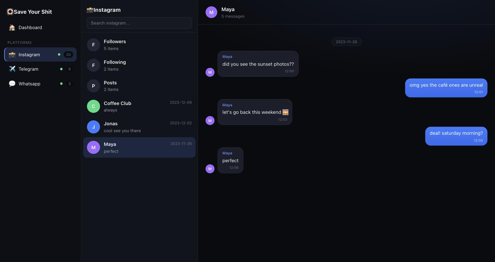
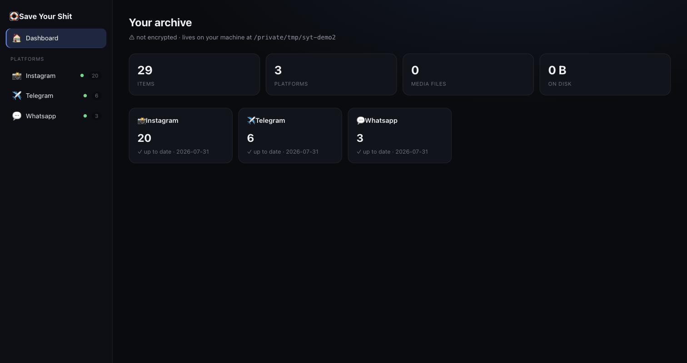
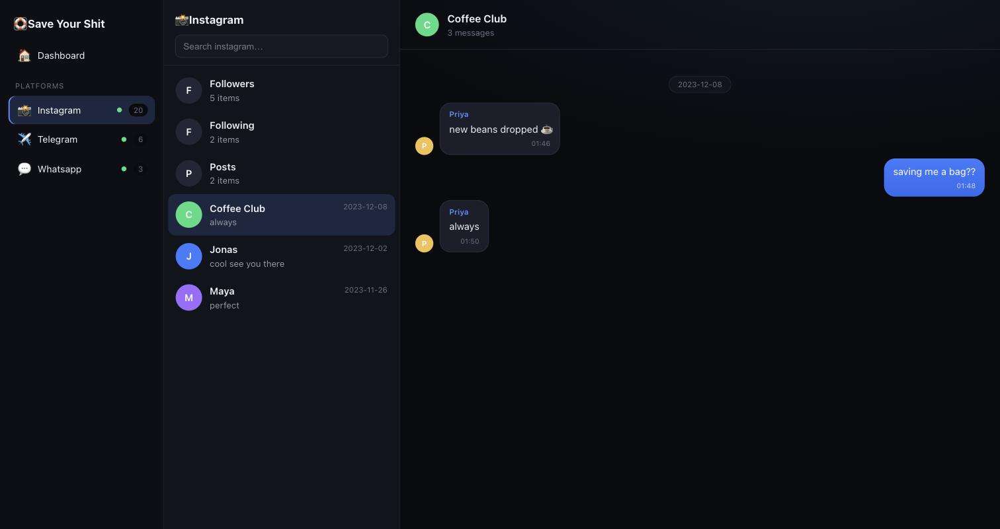

<div align="center">

# 🛟 Save Your Shit

**A local-first backup for your own social-media data.**
Instagram, Facebook, Discord, X — your chats, photos, followers, and posts,
encrypted on *your* disk. No server. No account. Nothing ever leaves your machine.

Because when a platform bans you, its "Download your data" button stops working too.
The backup has to already exist.

</div>

<p align="center">
  
</p>
<p align="center">
  
  
</p>
<p align="center"><em>The local web app (<code>syt serve</code>): your DMs as real
conversations, a dashboard across every platform, and instant full-text search —
all served from <code>127.0.0.1</code>, nothing leaves your machine.</em></p>

---

## Why

Platforms can ban an account with no warning and no chance to export. When that
happens, you lose everything — chats, photos, the people you followed. This tool
is your **second layer of backup**: it takes the data exports you're legally
entitled to and turns them into an encrypted, searchable archive you own forever.

- **Local-first, zero-server.** Everything runs on your computer. The only network
  traffic is to the platforms and (optionally) to *your own* cloud storage.
- **Encrypted by default.** AES-256, with a printable Recovery Kit. We never see a
  byte.
- **Searchable & yours.** Full-text search across all your chats and posts, offline,
  forever.
- **Safe.** It uses your official data-export rights — not risky scraping that could
  get your account banned (the very thing you're insuring against).

## Get started in 30 seconds

**One command** (installs `uv` if needed, then the `syt` command):

```bash
curl -LsSf https://raw.githubusercontent.com/arhxam/save-your-shit/master/install.sh | sh
```

Then:

```bash
syt init                                   # pick a passphrase, save your Recovery Kit
syt ingest ~/Downloads/instagram-export.zip   # auto-detects the platform
syt serve                                  # open the dashboard + viewer in your browser
syt status                                 # what's backed up and where it lives
syt search "that thing we talked about"    # full-text search, offline
```

Prefer to do it yourself? With [`uv`](https://docs.astral.sh/uv/) or `pipx`:

```bash
uv tool install --from git+https://github.com/arhxam/save-your-shit "saveyourshit[keyring]"
# after the first PyPI release this becomes simply:  pipx install saveyourshit
```

> **Download button coming:** signed desktop installers (`.dmg`/`.exe`/`.AppImage`)
> with a dashboard + data viewer land in Phase 2 — see [the roadmap](#roadmap).
> Until then, tagged releases attach built packages under
> [Releases](https://github.com/arhxam/save-your-shit/releases).

## How it works

1. **You** download your data export from a platform (a one-time click per refresh —
   see [Getting your exports](#getting-your-exports)).
2. **`syt ingest`** auto-detects the platform, copies the raw export in untouched,
   then parses it into a normalized, deduplicated, **encrypted** archive with a
   full-text search index.
3. **`syt status` / `syt search`** let you see and search everything. Your data
   lives in one folder (`~/SaveYourShit` by default) you can back up anywhere.

```
~/SaveYourShit/
├── index.sqlite         # full-text search index
├── blobs/               # your photos & videos (dedup'd, encrypted)
├── instagram/
│   ├── snapshots/       # your raw exports, kept forever, untouched
│   └── manifest.jsonl   # a diffable log of everything backed up
└── keys/                # your wrapped encryption key (never the passphrase)
```

## Getting your exports

Each platform has an official "download your data" flow. Request **JSON** format
where offered. Heads up: **the download links expire fast** (Instagram ~4 days,
X ~7 days), so grab them promptly.

| Platform | Where | Notes |
|----------|-------|-------|
| **Instagram** | Settings → Accounts Center → Your information → Download your information | Choose **JSON**. Includes DMs, followers, posts. |
| **Facebook** | Same Accounts Center flow | Messenger E2EE chats need "Secure Storage" on + your PIN. |
| **Discord** | Settings → Privacy & Safety → Request all my Data | Note: contains only *your half* of DMs (Discord's limit, not ours). |
| **X / Twitter** | Settings → Your account → Download an archive | Link expires in ~7 days. |
| **Telegram** | Telegram Desktop → Settings → Advanced → Export Telegram data | Choose **JSON**. Full chat history, zero risk. |
| **Reddit** | reddit.com → Settings → Privacy → Request a copy of your data | CSV export; one request per 30 days. |
| **WhatsApp** | In any chat → ⋮ → More → Export chat | Point `syt` at the exported `.txt` (with media). Fully local. |
| **Google / YouTube** | [Google Takeout](https://takeout.google.com) | Watch/search history, subscriptions, Google Chat. |
| **Slack** | Workspace → Settings → Import/Export Data → Export | Per-channel messages + files. |
| **Snapchat** | accounts.snapchat.com → My Data | Saved chats + Memories (links expire ~7 days — ingest promptly). |
| **LinkedIn** | Settings → Data Privacy → Get a copy of your data | Messages + connections. Link expires in 72h. |

Run `syt connectors` to see everything supported.

**The simplest habit:** drop your exports in one folder and let it sweep them up:

```bash
syt ingest ~/Downloads --all     # ingests every export it recognizes; safe to re-run
syt schedule --every daily       # (optional) do that automatically
```

That's the whole motion: download → it lands in a folder → a scheduled `ingest --all`
picks it up → it shows up in the app. See [docs/ARCHITECTURE.md](docs/ARCHITECTURE.md)
for how every piece connects.

## Your data & your keys

- **Encryption is on by default.** Your archive is encrypted with a key wrapped by
  your passphrase. Scheduled runs read the key from your OS keychain so you're not
  prompted every time.
- **Save your Recovery Kit.** Shown once at `syt init`. If you forget your passphrase
  *and* lose this machine, it is the only way back in. There is no reset link — that
  is the point. `syt recover <code>` restores access.
- Run `syt where` anytime to see exactly where every file lives.

## Commands

| Command | What it does |
|---------|--------------|
| `syt init` | One-time setup: folder, passphrase, Recovery Kit. |
| `syt ingest <path>` | Back up an export (`.zip` or folder); auto-detects platform. |
| `syt serve` | Launch the local web app (dashboard + viewer) in your browser. |
| `syt status` | Dashboard: items, media, size, and what's gone stale (`--json` for scripts). |
| `syt search <query>` | Full-text search across chats & posts. |
| `syt view` | Build a single-file offline HTML viewer of your archive. |
| `syt sync` | Encrypted versioned backup (restic) + mirror to your own cloud (rclone). |
| `syt schedule` | Set up a periodic staleness reminder (launchd/cron/schtasks). |
| `syt doctor` | Check your setup and optional tools. |
| `syt connectors` | List supported platforms. |
| `syt where [platform]` | Print exactly where data is stored. |
| `syt passphrase` / `syt recover` | Change or recover your passphrase. |

## Run it yourself in 2 minutes (with sample data)

Want to see it before touching your real accounts? This seeds a throwaway archive
and opens the app — nothing touches your accounts:

```bash
git clone https://github.com/arhxam/save-your-shit && cd save-your-shit
uv sync --extra keyring

# use a throwaway home so your real one is untouched
export SYT_HOME=/tmp/syt-demo

# make a tiny fake Instagram export and back it up
mkdir -p /tmp/ig/your_instagram_activity/messages/inbox/maya
printf '{"title":"Maya","messages":[{"sender_name":"Maya","timestamp_ms":1701000000000,"content":"did you see the sunset photos??"}]}' \
  > /tmp/ig/your_instagram_activity/messages/inbox/maya/message_1.json

uv run syt init --no-encrypt
uv run syt ingest /tmp/ig
uv run syt serve            # opens http://127.0.0.1:8787 in your browser
```

Then do it for real: run `syt init` (no `SYT_HOME` override), download your actual
exports (see [Getting your exports](#getting-your-exports)), and `syt ingest` each one.

**Test everything works:** `uv run pytest` (152+ tests) and `uv run syt doctor`.

## Roadmap

- **Phase 1 (now):** engine + `syt` CLI + 11 connectors (Instagram, Facebook,
  Discord, X, Telegram, Reddit, WhatsApp, Google/YouTube, Slack, Snapchat,
  LinkedIn) + the local web app (`syt serve`) + offline viewer + cloud sync
  (`restic`+`rclone`) + scheduling. ✅
- **Phase 2:** live connectors that auto-fetch (no manual export), and a packaged
  desktop app (the web app wrapped with a native installer + download button).
- **Phase 3:** a browser extension that safely triggers exports from your real
  session.

See [`docs/superpowers/specs/`](docs/superpowers/specs/) for the full design.

## Development

```bash
git clone https://github.com/arhxam/save-your-shit
cd save-your-shit
uv sync --extra keyring        # install deps
uv run pytest                  # run the test suite
uv run ruff check src tests    # lint
```

## License

MIT. This is your data — do whatever you want with it.
