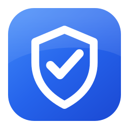
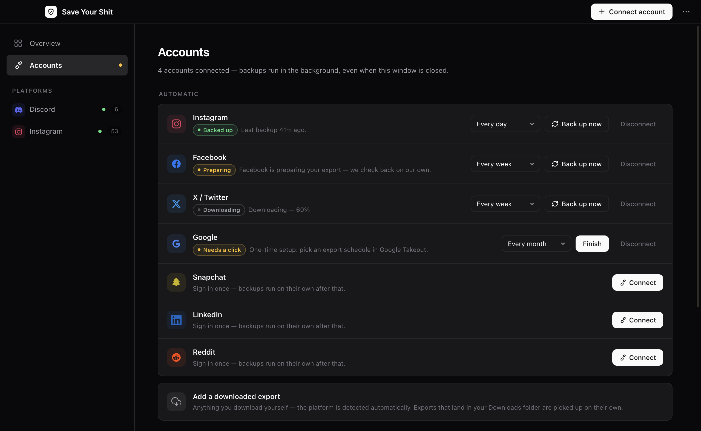
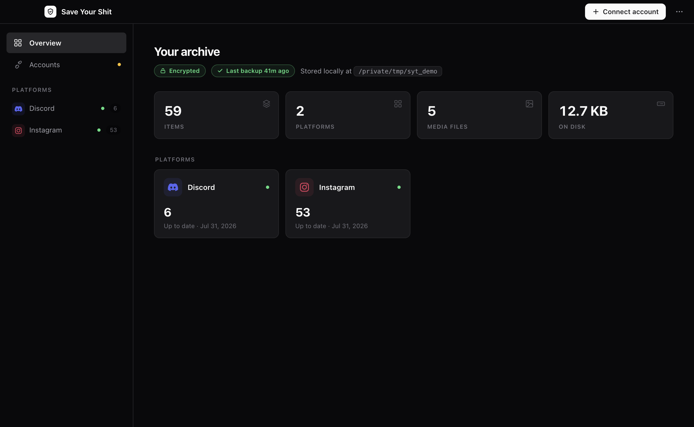
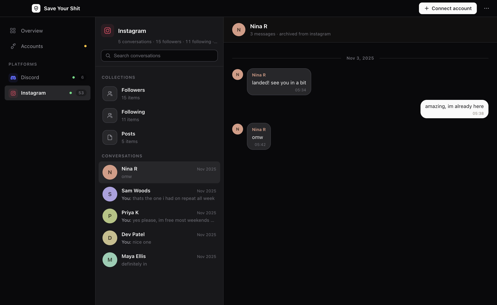

<div align="center">



# Save Your Shit

**Automatic, encrypted backups of your own social-media data — on your Mac, not a server.**

Connect an account once. It requests your official export, downloads it, and files it
away on a schedule. Instagram, Facebook, X, Google, Snapchat, LinkedIn, Reddit — plus
Discord, Telegram, WhatsApp and Slack by hand.

<a href="https://github.com/arhxam/save-your-shit/releases/latest"></a>

<sub>Signed and notarized by Apple — open the DMG, drag to Applications. No Terminal needed.</sub>

</div>

<br>

<p align="center"></p>

## Why

Platforms can ban an account with no warning and no chance to export. When that
happens you lose everything — chats, photos, the people you followed — and the
"Download your data" button stops working too. **The backup has to already exist.**

This turns the data exports you're legally entitled to into an encrypted, searchable
archive you own forever. It uses your official export rights, not scraping that could
get you banned — the very thing you're insuring against.

## How it works

1. **Connect once.** You sign in to the platform on its own page, in a window that
   belongs to the app. No password ever passes through this app.
2. **Pick a frequency.** Daily, weekly, monthly, or only when you ask.
3. **It runs.** The app requests your export, waits for the platform to prepare it
   (usually hours), downloads it, and adds it to your local encrypted archive.
4. **Only if needed.** If a platform wants a 2FA code or a password re-confirm, the
   app opens that exact page and asks for one click.

Everything happens on your Mac, from your own session. Nothing is ever uploaded.

<p align="center"></p>
<p align="center"></p>

## Platforms

**Automatic** — connect once, then hands-off:

| | |
|---|---|
| Instagram · Facebook | DMs, followers, following, posts, media |
| X / Twitter | tweets, DMs, followers |
| Google | Takeout: Chat, Photos, YouTube history |
| Snapchat · LinkedIn · Reddit | messages, connections, saved content |

**By hand** — no automatable web export exists, so you add the file yourself. Anything
matching an export that lands in your `~/Downloads` is picked up automatically.

| | |
|---|---|
| Discord | delivered by email link only |
| Telegram | exported from Telegram Desktop |
| WhatsApp | exported from the phone app |
| Slack | workspace owners only |

## Built to be left alone

- **Starts at login**, so a reboot resumes the schedule instead of resetting it.
- **Stays connected.** Sign-ins live in a per-platform session on your Mac and are
  written to disk before every quit. If a platform really does log you out, the app
  finds out by asking the platform — not by trusting a stale cookie.
- **Never drops an export.** Every download is queued to disk *before* the backup
  starts, so a crash or a power cut is finished on the next launch. A failed backup
  retries and keeps the file.
- **Catches up.** Schedules are wall-clock based: a laptop that was asleep for a week
  is due the moment it wakes.
- **Cheap when idle.** No windows, no viewer process, one timer.

The app lives in the menu bar after you close the window — that's what lets the
schedule fire. Quit it from there to stop entirely.

## Your data & your keys

Your archive is encrypted with AES-256 using a key wrapped by your passphrase, stored
in one folder you can back up anywhere:

```
~/SaveYourShit/
├── index.sqlite      # full-text search index
├── blobs/            # your photos & videos (deduplicated, encrypted)
├── instagram/
│   ├── snapshots/    # your raw exports, kept forever, untouched
│   └── manifest.jsonl
└── keys/             # your wrapped key — never the passphrase
```

**Save your Recovery Kit.** It's shown once at setup and written to
`~/SaveYourShit/RECOVERY-KIT.txt`. If you forget your passphrase *and* lose this
machine, it is the only way back in. There is no reset link — that's the point.

## Command line

The engine is also a CLI, if you prefer typing:

```bash
curl -LsSf https://raw.githubusercontent.com/arhxam/save-your-shit/master/install.sh | sh
```

```bash
syt init                              # set up, save your Recovery Kit
syt ingest ~/Downloads/export.zip     # back up an export (auto-detects the platform)
syt ingest ~/Downloads --all          # sweep a whole folder; safe to re-run
syt serve                             # open the app in your browser
syt status                            # what's backed up, and what's gone stale
syt search "that thing we talked about"
```

| Command | What it does |
|---------|--------------|
| `syt check <path>` | Dry run: show what it found, write nothing. |
| `syt view` | Build a single-file offline HTML viewer. |
| `syt sync` | Encrypted versioned backup (restic) + mirror to your own cloud (rclone). |
| `syt where` | Print exactly where every file lives. |
| `syt doctor` | Check your setup. |
| `syt passphrase` / `syt recover` | Change or recover your passphrase. |

Run `syt --help` for everything.

## Try it with sample data

See it before touching a real account:

```bash
git clone https://github.com/arhxam/save-your-shit && cd save-your-shit
uv sync --extra keyring
export SYT_HOME=/tmp/syt-demo          # throwaway, leaves your real archive alone

mkdir -p /tmp/ig/your_instagram_activity/messages/inbox/maya
printf '{"title":"Maya","messages":[{"sender_name":"Maya","timestamp_ms":1701000000000,"content":"did you see the sunset photos??"}]}' \
  > /tmp/ig/your_instagram_activity/messages/inbox/maya/message_1.json

uv run syt init --no-encrypt
uv run syt ingest /tmp/ig
uv run syt serve                       # http://127.0.0.1:8787
```

## Development

```bash
uv sync --extra keyring
uv run pytest                  # engine + UI tests
uv run ruff check src tests    # lint

cd app && npm install
npm test                       # automation + reliability tests
npm start                      # run the desktop app
npm run dist                   # build a DMG
```

Building the Mac app bundles a frozen copy of the engine — rebuild it with
`cd packaging && uv run pyinstaller syt.spec --noconfirm --distpath ../dist` after
changing anything in `src/`. See [docs/BUILDING-APP.md](docs/BUILDING-APP.md).

## Roadmap

- **Now:** engine + CLI + 11 connectors, the local app, automatic scheduled backups
  for 7 platforms, encrypted archive, cloud sync.
- **Next:** Windows and Linux builds; more platforms on the automatic path.

## License

MIT. This is your data — do whatever you want with it.
